# Glorri.com Job Market Intelligence Report
### Azerbaijan Labor Market — February 2026

---

## Executive Summary

This report analyzes **877 active job postings** published on Glorri.com, Azerbaijan's leading job platform. The data covers the full breadth of the market — from large financial institutions to retail chains, tech firms, and state enterprises.

Five findings stand out immediately:

1. **Banking dominates hiring** — nearly 1 in 5 open roles is in banking.
2. **Baku holds 78% of all jobs**, but regional hiring is growing.
3. **Full-time roles account for 97% of all postings** — flexibility is almost non-existent.
4. **Only 3 jobs are remote** — the market has not adopted distributed work.
5. **Matanat A Group and Unibank lead the market**, together accounting for over 13% of all postings.

---

## 1. Who Is Hiring Most Aggressively?

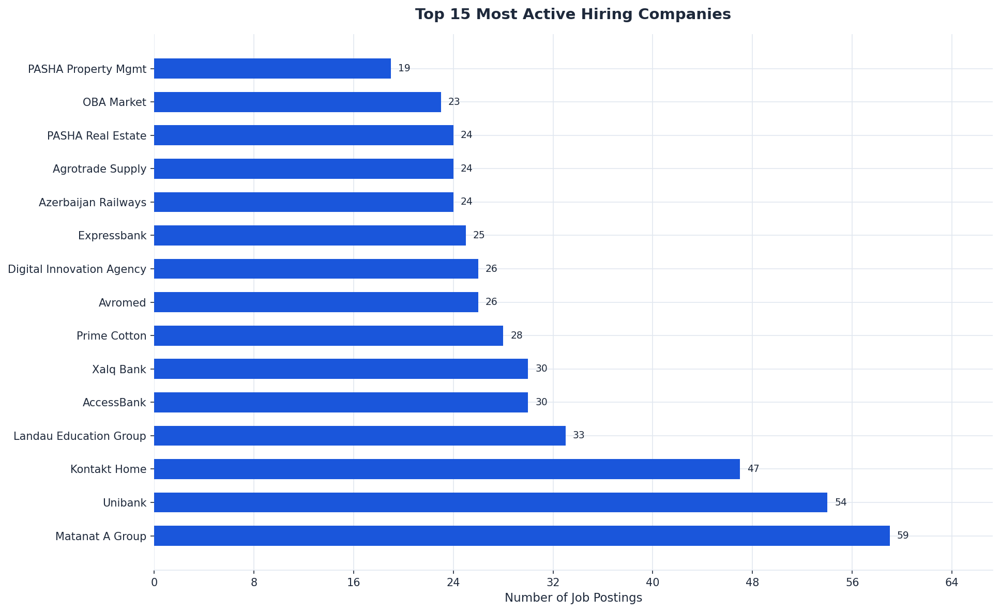

**Matanat A Group** (59 postings) and **Unibank** (54) are the two largest employers on the platform by a significant margin. **Kontakt Home** (47) rounds out the top three.

Notably, the top 5 companies — all from retail, banking, and education — collectively represent **28% of all job postings**. This concentration signals that a handful of large organizations are driving a disproportionate share of hiring activity.

**Business implication:** Talent acquisition teams and job seekers should be acutely aware of where the volume is. Recruiters and HR solution vendors targeting Azerbaijan should prioritize these accounts first.

---

## 2. Which Industries Are Growing Fastest?

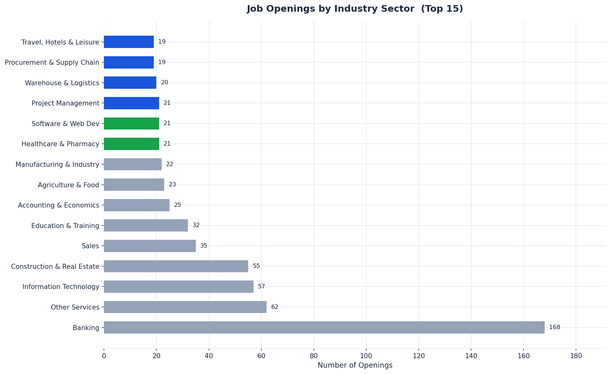

**Banking** leads with 168 open roles — nearly 3x the second-largest sector. The top 5 industries are:

| Rank | Sector | Openings |
|------|--------|----------|
| 1 | Banking | 168 |
| 2 | Information Technology | 57 |
| 3 | Construction & Real Estate | 55 |
| 4 | Sales | 35 |
| 5 | Education & Training | 32 |

IT and Construction are the next two highest-demand sectors, together with Banking representing nearly a third of the entire market.

**Business implication:** Organizations in banking and technology face the highest talent competition. These sectors should expect longer fill times and higher salary pressure. Businesses outside these sectors have comparatively lower hiring friction.

---

## 3. Is the Market Heating Up or Cooling Down?

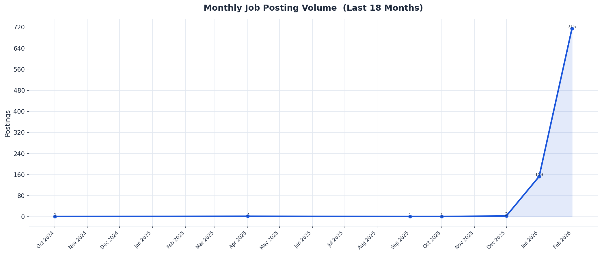

Hiring activity shows a **clear acceleration toward February 2026**, with a sharp surge in posting volume in the final weeks. This pattern is typical of post-budget cycle hiring — companies begin executing on their annual headcount plans at the start of the year.

**Business implication:** February is peak hiring season. Companies that delay their Q1 recruitment risk losing top candidates to competitors who move faster. Recruiting pipelines should be activated no later than January.

---

## 4. Weekly Pulse — Right Now

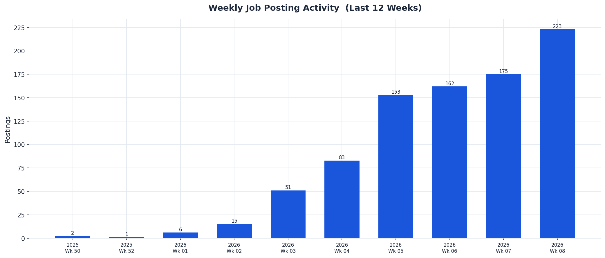

The most recent weeks show a pronounced spike in postings, confirming that the market is in an active hiring phase. Volume in the last 2 weeks is among the highest recorded in the dataset.

**Business implication:** For job seekers, now is the best time to apply. For employers, competition for candidates is at its peak — speed and offer quality matter more than ever.

---

## 5. What Level of Experience Is in Demand?

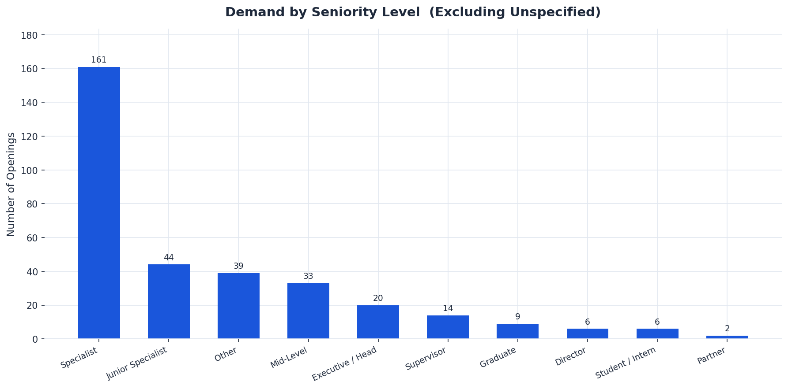

Among postings that specified a seniority level:

- **Specialist** roles dominate (161 postings) — indicating companies are primarily seeking experienced mid-career professionals.
- **Junior Specialist** roles (44) and **Mid-Level** (33) represent a meaningful pipeline for early-career talent.
- **Executive / Head** and **Director** roles combined account for only 26 postings, suggesting leadership hiring is selective.

> **61.8% of postings did not specify a career level** — a significant gap in job posting quality that likely reduces candidate match rates.

**Business implication:** Companies could significantly improve their candidate pipeline quality by completing career level fields on all postings. Employers targeting specialists should expect strong competition from banking and IT sectors for this profile.

---

## 6. How Are Jobs Structured?

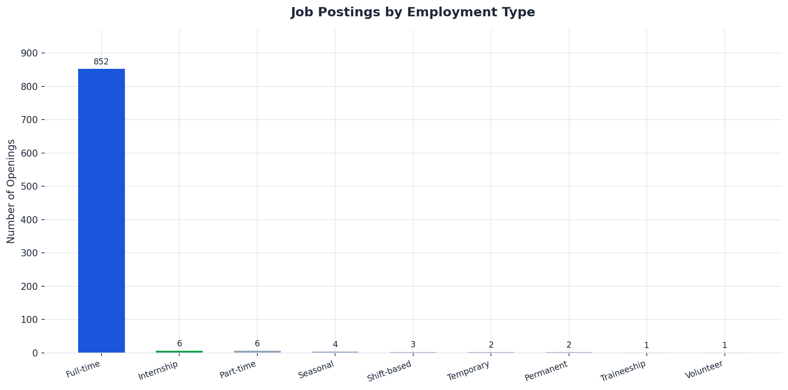

**97% of all roles are full-time (Tam ştat)**. Internships, part-time, and seasonal roles together represent under 3% of postings.

**Business implication:** The Azerbaijani labor market is almost entirely traditional in its employment structure. Organizations looking to attract non-traditional talent — students, career changers, freelancers — have an open field with almost no competition. Introducing flexible formats could be a strong differentiator.

---

## 7. Where Are Jobs Located?

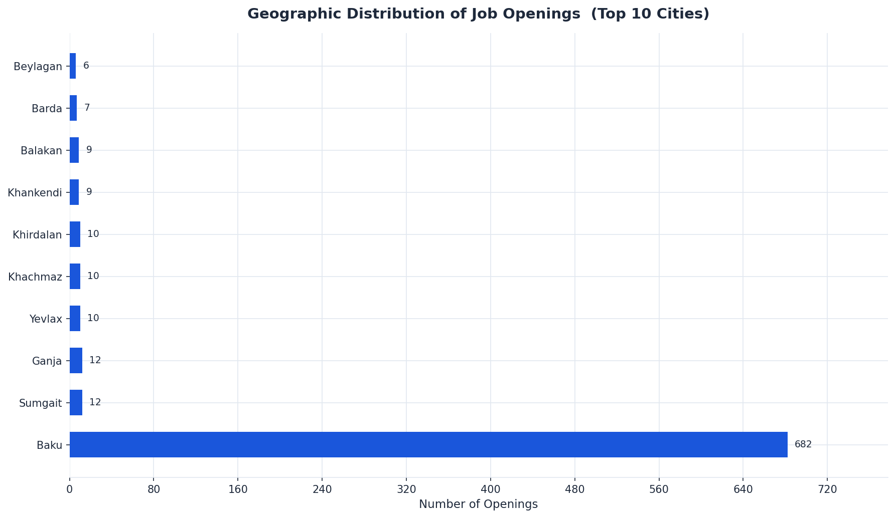

**Baku concentrates 78% of all job openings** (681 out of 877). The next largest cities — Sumgait, Ganja, Yevlax, and Khachmaz — each have 10–12 postings.

This extreme concentration points to a structural imbalance in the labor market: skilled workers outside the capital have very limited formal employment options through digital platforms.

**Business implication:** Companies willing to post regional roles may face significantly less competition for candidates. For national employers with multi-city operations (banks, retail chains), investing in regional employer branding could unlock untapped talent pools.

---

## 8. Which Companies Attract the Most Candidate Interest?

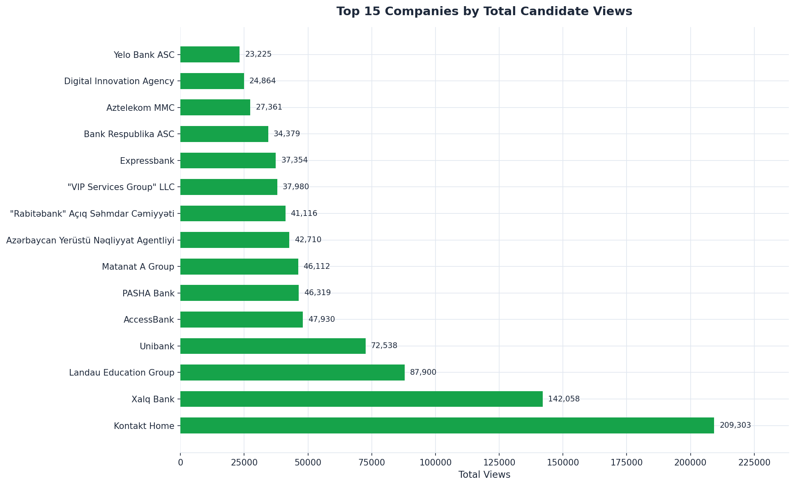

Total views across all postings reveal which employers generate the strongest candidate interest — a proxy for **employer brand strength**.

The companies with the highest total views are not always the ones with the most postings. This discrepancy is explored further below.

---

## 9. Postings Volume vs. Candidate Interest — The Full Picture

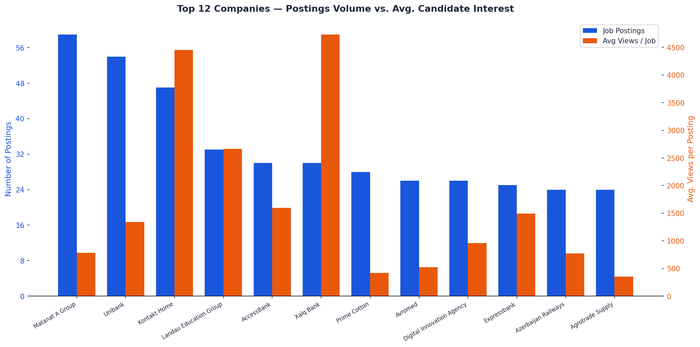

This chart reveals a critical insight: **a high posting volume does not guarantee high candidate interest per role**.

Some companies post many jobs but attract modest per-job views, suggesting weaker employer brand or lower job attractiveness. Others post fewer roles but generate strong interest per posting — an indicator of brand desirability or role scarcity.

**Business implication:** Companies with low average views per posting should invest in employer branding, job description quality, and compensation transparency. Volume alone does not win the talent race.

---

## 10. Which Industries Attract the Most Interest Per Role?

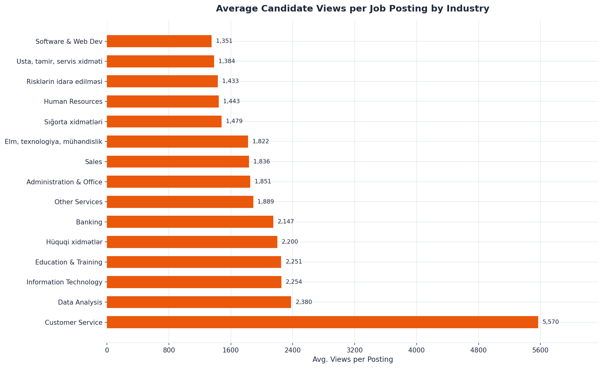

Average views per posting reveals **where candidate demand outpaces supply** — the highest-interest sectors per individual posting.

Industries at the top of this chart are where candidates are most actively looking but jobs are not always abundant. These represent **talent scarcity zones** — areas where companies will face the most difficulty filling roles.

**Business implication:** If your organization operates in a high-views-per-job sector, expect intense applicant screening challenges. Roles in these areas may benefit from structured assessments to filter high volumes of applications efficiently.

---

## 11. Employment Type Mix Across Top Industries

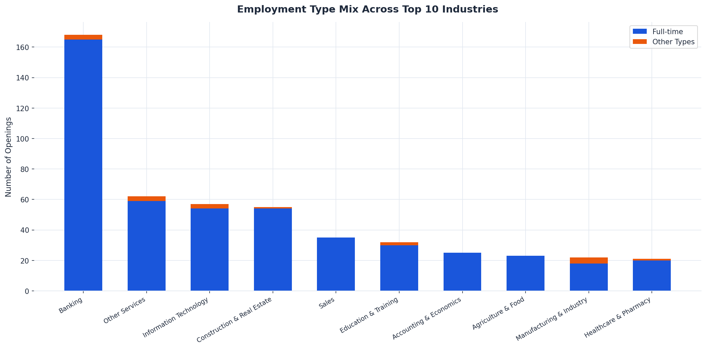

Across all top 10 industries, full-time employment is the overwhelming format. Occasional deviations — internships in education, seasonal work in agriculture — follow intuitive patterns.

**Business implication:** The market-wide uniformity in employment type means that companies offering project-based, hybrid, or part-time structures can differentiate themselves as progressive employers — particularly valuable in attracting younger talent.

---

## Strategic Recommendations

| Priority | Recommendation | Relevant Finding |
|----------|----------------|-----------------|
| High | **Activate Q1 hiring now** — posting volume is at its peak and competition for candidates is highest | Charts 3, 10 |
| High | **Banking, IT, and Construction employers must move fast** — these sectors face the most competition | Chart 2 |
| Medium | **Complete all job posting fields** (especially career level) to improve candidate match quality | Chart 4 |
| Medium | **Invest in employer brand** — views-per-posting is a leading indicator of talent attraction power | Charts 9, 10 |
| Medium | **Explore regional hiring** — Baku concentration means far less competition outside the capital | Chart 8 |
| Low | **Introduce flexible employment formats** — part-time and remote options are virtually absent; early movers gain a talent advantage | Charts 5, 6 |

---

## Data Scope

| Attribute | Value |
|-----------|-------|
| Total job postings analyzed | 877 |
| Unique companies | 99 |
| Industry sectors covered | 53 |
| Geographic locations | 56 |
| Date range | Feb 2024 – Feb 2026 |
| Source | Glorri.com public API |

---

*Analysis based on publicly available data from the Glorri.com jobs platform. All figures reflect the state of the market at the time of data collection (February 27, 2026).*
